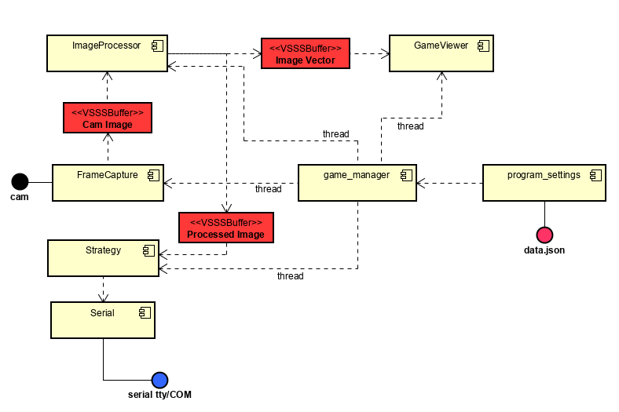

# GER Very Small Size Soccer

Repositório de código direcionado à competição na categoria de Very Small Size Soccer
[(VSSS)](http://www.cbrobotica.org/?page_id=81) produzido pelo Grupo de Estudos em Robótica
da Unicamp (GER).

## Pré-requisitos

Para executar o código deste repositório, é **necessário** ter instalado uma máquina Linux
com as seguintes bibliotecas instaladas:

 - [OpenCV](https://opencv.org/) 3.x ou mais recente para computação visual
 - [Armadillo](http://arma.sourceforge.net/) para algebra linear em C++
 - [JSON for Modern C++](https://github.com/nlohmann/json) para *parsing* de JSON
   - Instalar como submodulo git: fazer `git clone --recursive ...` 
ou ` git submodule init && git submodule update` caso já tenha clonado o repositório

Para facilitar o uso destas bibliotecas, **recomenda-se** a instalação do [vscode](https://code.visualstudio.com/), com extensões de C/C++ e Doxygen para documentação de código.
Para gerenciar as configurações de câmera, é **fortemente recomendada** a instalação do
*v4l-utils* e do *guvcview*.
Para upload de código para *Arduino*, também é recomendada a instalação da [Arduino IDE](https://www.arduino.cc/en/Main/Software), com a biblioteca do rádio [RF24](https://github.com/rodrigocaus/RF24).
O uso do *vscode* com o *core* do *Arduino* torna a experiência mais eficiente.

## Calibrando as cores

Executar o *vision/calibration/calibration.py* com *Python*, utilizando como argumento o **inteiro**
referente ao número da câmera (geralmente 0 ou 1).
As informações resultantes do processo de calibração, bem como configurações da câmera, serão colocadas
no arquivo *data.json*.

## Executando o jogo

Tendo instalado todas as bibliotecas e assegurando o Arduino conectado à porta ttyACM0, o primeiro
passo é a compilação definida no *Makefile* executando `make` no terminal.
O executável gerado é *game.exe* (não confunda, este executável não roda em máquinas com Windows a 
princípio). Para executar, o comando `./game.exe --team=yellow --cam=0 --flip=n`, ou com configurações
de jogo análogas, roda o jogo. Caso haja dúvidas sobre as configurações possíveis, o comando `./game -h`
dará mais detalhes.

## Distribuição de Arquivos

A relação de componentes e a interação entre eles pode ser vista no diagrama

Os códigos de cada componente estão distribuidos em uma hierarquia de pastas que estão separadas por 
funções de código.

### Códigos de *Arduino*

Separados em três pastas. A *arduino_libraries* contém código-fonte para as bibliotecas de *Arduino*
desenvolvidas pelos integrantes do GER. A *emissor* possui o código-fonte principal do *Arduino* ligado
ao computador. E por fim, a *jogador*, que possui o código-fonte principal do *Arduino* que controla cada
robô.

### Vision

Contém os códigos de captura (*FrameCapture*), processamento (*ImageProcessor*) e visualização 
(*GameViewer*) das imagens obtidas da câmera frame a frame, cujas classes estão declaradas em *vision.h*. 
Também possui a estrutura de um buffer (*VSSSBuffer*) implementado para acesso e escrita em regiões de 
memória de forma segura por diferentes processos ou threads. Por fim, contém o *calibration*, que não 
é executado durante à partida, mas é responsável por gerar o arquivo de configurações de câmera e cores, 
*data.json*.

### Strategy

Contém o modelo do estado de jogo, que contém os robôs e a bola, bem como o código da estratégia de jogo.
O código da estratégia utiliza a porta serial para comunicação com o *Arduino* emissor, cuja lógica está
implementada em *serial*.

### Manager

Contém o código *main* em *game_manager*, responsável por criar as *threads* que fazem captura, 
processamento e exibição de imagem, e de estratégia de jogo. Também possui o código responsável por 
processar o *data.json*, em *program_settings*, para fazer o *parsing* do arquivo e inicializar as 
configurações do programa corretamente.

## Problemas

Caso exista algum problema, de compilação, execução ou instalação de algum programa pré-requisito
abra uma *issue* para relatar e os componentes do grupo trabalharão em cima dela.
